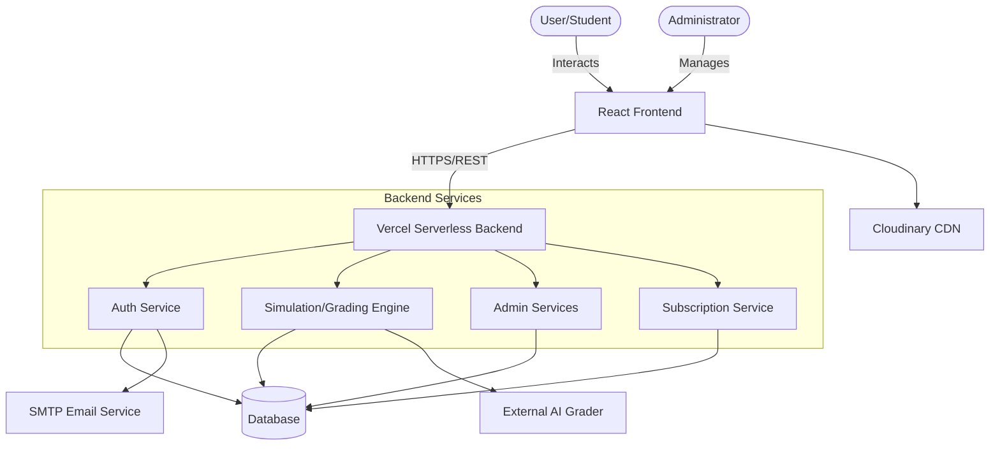
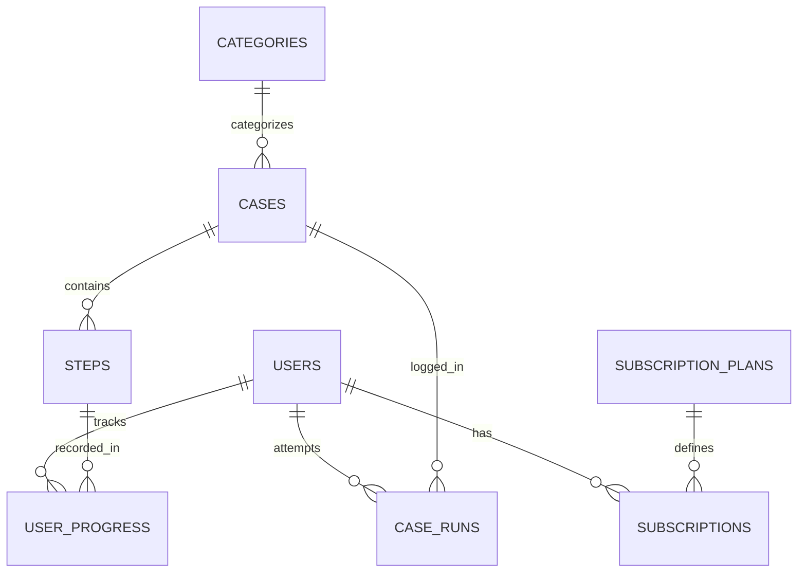
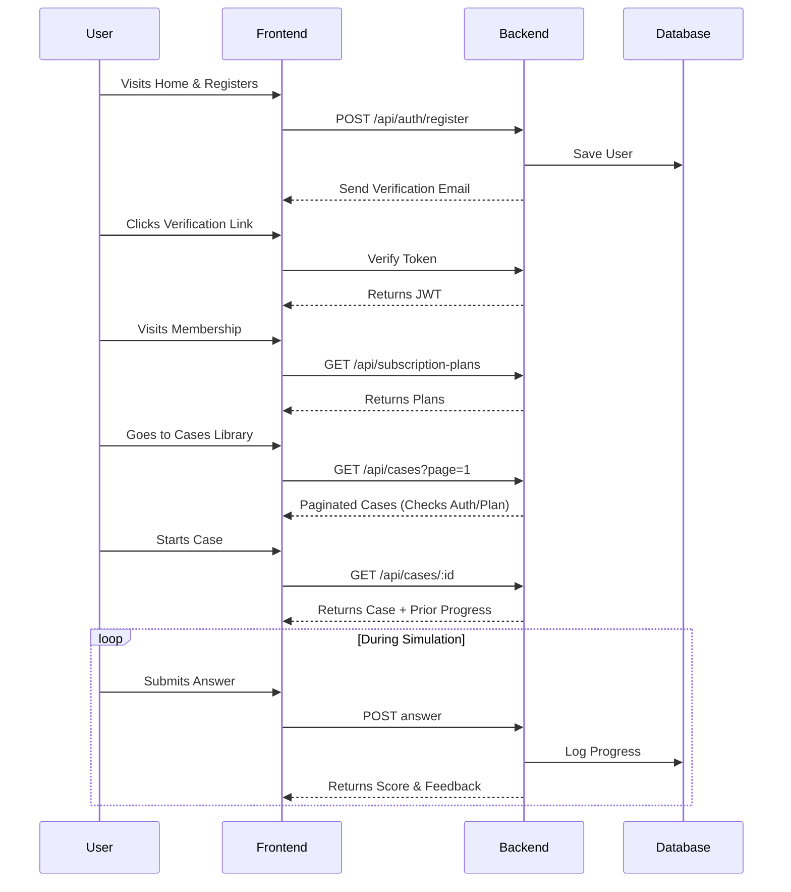
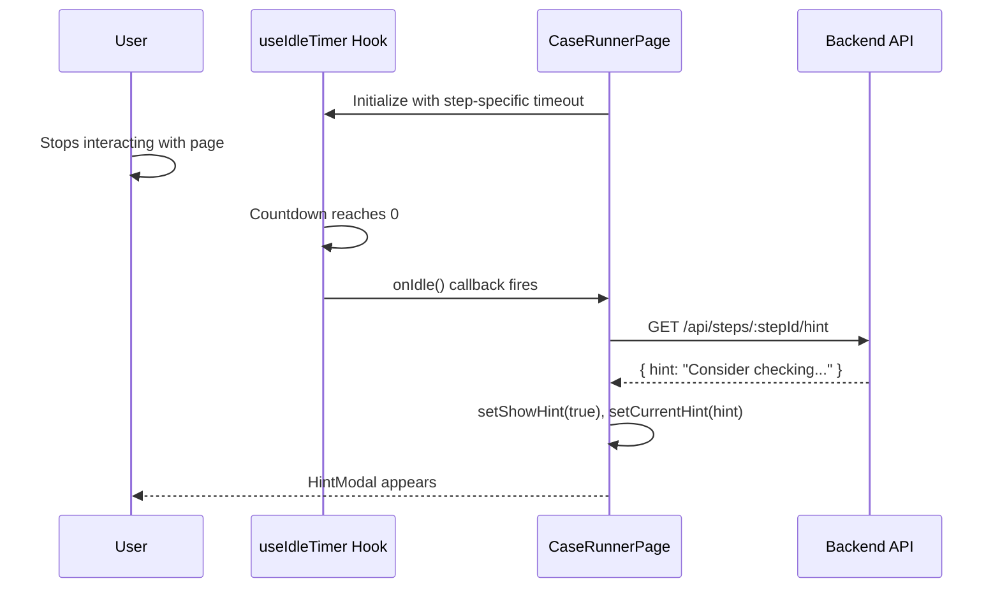

# PhysioSim — Comprehensive System Architecture Report

> **Prepared by:** Senior Software Architect  
> **Date:** May 2026  
> **Classification:** Comprehensive Technical Documentation  
> **System Version:** 1.0.x (Production on Vercel)

---

## Table of Contents

1. System Overview
2. Architecture Design
3. Frontend Layer Architecture
4. Backend Layer Architecture
5. Database & Data Modeling
6. System Flow (End-to-End)
7. Integration & Communication
8. Scalability & Performance
9. Security Considerations
10. Advantages (Strengths)
11. Disadvantages (Weaknesses)
12. Best Practices & Recommendations

---

## 1. System Overview

### 1.1 Purpose & Goals
**PhysioSim** is a comprehensive clinical simulation, e-learning, and mentorship platform purpose-built for physiotherapy education. It provides an end-to-end user journey from public marketing, through subscription management, to an interactive clinical simulation engine. It enables students, trainees, and educators to engage with realistic, structured patient cases in a controlled digital environment — replicating the cognitive and clinical reasoning processes of real-world physiotherapy practice.

### 1.2 Main System Modules & Features
| Module | Description |
|---|---|
| **Public/Marketing** | Landing page (`HomePage`) with animations, features, and call-to-action. |
| **Authentication** | Registration, Login, Forgot Password, and Email Verification flows. |
| **Membership Tiers** | Subscription management granting tiered access (Free vs. Premium) to specific cases. |
| **Case Library** | Searchable, filterable catalog of clinical cases (`CasesPage`) with visual locks for restricted content. |
| **Simulation Engine** | Multi-step, AI-graded clinical scenarios (`CaseRunnerPage`) supporting MCQ, Essay, Diagnosis, Problem List, and Treatment. |
| **Adaptive Hints** | Idle-time detection triggers AI hints for struggling students. |
| **Progress Persistence**| Mid-session resume with full state hydration. |
| **User Dashboard** | Profile management, statistics, and leaderboard ranking (`ProfilePage`). |
| **Admin Panel** | Content management (Case Editor), user management, analytics, and platform oversight (`AdminDashboard`). |

### 1.3 System Type
PhysioSim is a **full-stack, client-server web application** with a React Single-Page Application (SPA) frontend deployed on Vercel, paired with a Node.js/Express REST API backend also hosted on Vercel (Serverless Functions), and backed by a cloud-hosted relational/document database.

---

## 2. Architecture Design

### 2.1 Overall Pattern
The system employs a **Serverless Monolithic/Layered Architecture** with clear separation of concerns:

```
┌─────────────────────────────────────────────────────────────┐
│                      CLIENT LAYER (React SPA)               │
│  Pages → Components → Context → Hooks → API calls (Axios)   │
└──────────────────────────┬──────────────────────────────────┘
                           │  HTTPS REST (JWT Bearer)
┌──────────────────────────▼──────────────────────────────────┐
│                    API GATEWAY / BACKEND                     │
│   Express.js REST API  ·  Auth Middleware  ·  Controllers    │
└──────────────────────────┬──────────────────────────────────┘
                           │  ORM / Query Layer
┌──────────────────────────▼──────────────────────────────────┐
│                       DATABASE LAYER                         │
│          Cloud Database (Relational or NoSQL)                │
└─────────────────────────────────────────────────────────────┘
```

### 2.2 Component Interaction Map


---

## 3. Frontend Layer Architecture

### 3.1 Technology Stack
| Technology | Version | Role |
|---|---|---|
| **React** | 19.2.0 | Core UI framework |
| **Vite** | 7.x | Build tool + Dev server |
| **React Router DOM** | 7.x | Client-side routing |
| **Tailwind CSS** | 3.4 | Utility-first styling |
| **Framer Motion & GSAP**| 12.x / 3.x | Animations and scroll effects |
| **Radix UI** | 1-2.x | Accessible headless components |
| **Axios** | 1.x | HTTP client |
| **Recharts** | 3.x | Data visualization |

### 3.2 Key Page Architectures
- **Home Page (`HomePage.jsx`):** Uses Framer Motion for scroll-triggered animations. Highly modularized into `Hero`, `Features`, `HowItWorks`, and `CTASection`.
- **Cases Library (`CasesPage.jsx`):** Implements server-side pagination and filtering (Category, Difficulty, Duration) via URL Search Params. Includes visual locks for restricted content.
- **Membership (`MembershipPage.jsx`):** Fetches dynamic subscription plans. Identifies current user plan and highlights recommended/premium tiers.
- **Simulation Engine (`CaseRunnerPage.jsx`):** A complex, state-heavy engine (~1300 lines) orchestrating different clinical step types. Uses a robust `updateLocalProgress` optimistic UI pattern.
- **Admin Dashboard (`AdminDashboard.jsx`):** Tab-based interface for managing the platform. Features high-level statistics, recent activity feeds, and a library management interface.
- **Profile (`ProfilePage.jsx`):** User statistics, image upload (Base64 data URL pattern), and historical case performance.

### 3.3 State Management Strategy
PhysioSim avoids heavy global state managers (like Redux) in favor of:
1. **Component-local state** (`useState`) — dominant pattern.
2. **React Context** — `ToastContext` for notifications.
3. **`localStorage`** — Auth token and user object persistence.
4. **URL params** — Used for filtering in `CasesPage` and identifying cases in `CaseRunnerPage`.
5. **`useMemo`/`useCallback`** — Extensive use for derived state (like grouping sub-steps into clinical hubs) and memoized event handlers.

---

## 4. Backend Layer Architecture

### 4.1 Technologies
- **Runtime:** Node.js / Express.js
- **Environment:** Vercel Serverless Functions
- **Authentication:** JWT (JSON Web Tokens)
- **External Integration:** External AI service for essay grading, SMTP for emails.

### 4.2 Core API Domains
1. **Auth API** (`/api/auth/*`): Registration, login, forgot password, email verification.
2. **Cases API** (`/api/cases/*`): Fetching case catalog with filters (`page`, `limit`, `search`, `category`).
3. **Simulation API** (`/api/cases/:id/steps/:stepId/*`): Submission endpoints for MCQs, structural answers (Problem Lists), and essays (AI graded). Returns `{ correct, score, feedback }`.
4. **User/Profile API** (`/api/profile/stats`): Aggregates user performance, ranks, and subscription status.
5. **Admin API** (`/api/admin/*`): Privileged endpoints for fetching global stats, managing users, and CRUD operations on cases.

---

## 5. Database & Data Modeling

### 5.1 Data Storage Strategy
| Data | Storage Location | Rationale |
|---|---|---|
| Auth token + user info | `localStorage` (client) | Fast access, persists across tabs |
| Case + step definitions | Database (server) | Source of truth, admin-editable |
| User progress per step | Database (`USER_PROGRESS`) | Enables robust session resume |
| Profile images / Assets | Cloudinary (CDN) | Offloads binary storage for high performance |

### 5.2 Entity Relationship Model


---

## 6. System Flow (End-to-End)

### 6.1 The Complete User Journey


### 6.2 Idle Hint Adaptive Flow


---

## 7. Integration & Communication

### 7.1 Protocols
- **HTTPS:** Enforced for all client-server communication.
- **REST:** Primary API paradigm.
- **JWT:** Stateless authentication (`Authorization: Bearer <token>`).

### 7.2 Authorization Matrix
| Resource | Public | Authenticated | Admin |
|---|---|---|---|
| Home, About, Membership | ✅ | ✅ | ✅ |
| Cases catalog | ✅ | ✅ | ✅ |
| Case Runner (Simulation) | ❌ | ✅ | ✅ |
| Profile, Leaderboard | ❌ | ✅ | ✅ |
| Admin Dashboard | ❌ | ❌ | ✅ |
| Case Editor | ❌ | ❌ | ✅ |

---

## 8. Scalability & Performance

### 8.1 Current Architecture Characteristics
- **Frontend Distribution:** Static SPA served from Vercel CDN provides sub-100ms Time-to-First-Byte (TTFB) globally.
- **Backend Scaling:** Vercel serverless functions auto-scale infinitely based on demand.
- **Build Optimization:** Vite handles highly optimized tree-shaken bundles.

### 8.2 Bottlenecks
- **No Client-Side Caching:** The application fetches raw data on almost every navigation (e.g., loading `/cases` triggers a full backend query).
- **Monolithic `CaseRunnerPage`:** This 1300-line component manages 15+ state variables. Rapid keystrokes inside an essay field can cause large sub-tree re-renders if not carefully memoized.
- **Serverless Cold Starts:** Initial API requests after idle periods can experience 200-500ms latency.

---

## 9. Security Considerations

| Vulnerability | Risk Level | Current State & Mitigation |
|---|---|---|
| **JWT in localStorage** | Medium | Susceptible to Cross-Site Scripting (XSS). *Recommendation: Migrate to `httpOnly` secure cookies.* |
| **No Token Refresh** | Medium | Expired tokens force hard re-logins. No sliding sessions implemented. |
| **Client-side Route Guards** | Low/Medium | Frontend hides admin panels, but API must rigorously validate `role === 'admin'` to prevent direct API abuse. |
| **Cheating / Content Theft** | Medium | `WatermarkOverlay` prevents basic screenshot theft. However, Problem List grading occurs partially client-side and can theoretically be manipulated. |

---

## 10. Advantages (Strengths)

- **Optimistic UI:** `updateLocalProgress()` immediately updates the UI before the server responds, creating a blazing-fast user experience.
- **Zero-Config Infrastructure:** Deploying frontend and backend together on Vercel eliminates DevOps overhead.
- **Rich Pedagogy:** The simulation engine supports 8+ distinct interactive clinical step types, creating a realistic medical simulation.
- **Adaptive Learning:** The custom `useIdleTimer` accurately detects struggling learners and fetches contextual AI hints.
- **Resilient Session Management:** Full progress hydration from the backend allows students to drop mid-case and resume days later seamlessly.

---

## 11. Disadvantages (Weaknesses)

- **Prop Drilling for Auth:** The `auth` object and `setAuth` function are passed down through multiple component layers manually.
- **Maintainability Risks:** Massive components like `CaseRunnerPage` and `CaseEditorPage` are complex and difficult to test.
- **Lack of TypeScript:** The codebase is a mix of `.js`, `.jsx`, and `.tsx`. Without strict interfaces for `caseData` and `userProgress`, regressions are highly likely during refactors.
- **No Test Coverage:** No unit, integration, or E2E tests are present in the repository.

---

## 12. Best Practices & Recommendations

### High Priority (Immediate Fixes)
1. **Extract `CaseRunnerPage` State:** Move the 15+ state variables into a custom `useCaseRunner` hook to separate business logic from UI rendering.
2. **Migrate to `httpOnly` Cookies:** Update the backend Auth controller to issue HTTP-only, Secure cookies rather than sending raw JWTs to be stored in `localStorage`. This neutralizes XSS token theft.

### Medium Priority (Performance & Architecture)
1. **Implement Client-Side Caching:** Adopt `@tanstack/react-query` or `SWR`. This will cache responses for `CasesPage`, `MembershipPage`, and `ProfilePage`, drastically reducing loading spinners and server costs.
2. **Adopt Global State Management:** Introduce `Zustand` for global `auth` and `user` state to eliminate prop drilling across the application.

### Low Priority (Long-term Stability)
1. **Incremental TypeScript Migration:** Define strict `interface` definitions for core domain models (`Case`, `Step`, `UserProgress`).
2. **Automated Testing:** Implement Playwright or Cypress E2E tests covering the critical user path: `Registration -> View Cases -> Run Simulation -> View Profile`.
3. **Backend Rate Limiting:** Implement rate limiting on sensitive endpoints (like `login`, `register`, and the AI essay grader) to prevent abuse and manage API costs.

---
*End of Report — PhysioSim System Architecture v1.0*
